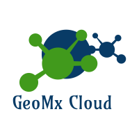

<p align="center">



</p>

**GeoMx Cloud** is an application that can be used to perform common bioinformatics
analyses for spatial transcriptomics data such as descriptive analyses of sample annotations,
exploratory data analysis, differential expression analysis. All computations are performed in the cloud (Amazon Web Services) and the results (R-file) are emailed to the user. The R-file can then be uploaded to GeoMx Cloud for interactive visualizations.

## Get started

  1) Install [R v4.0.2](https://www.r-project.org/)
  2) Install [RStudio v1.3.1073](https://www.rstudio.com/products/rstudio/download/)
  3) Make Amazon Web Services (AWS) account: [AWS Free Tier](https://aws.amazon.com/free/?trk=ps_a134p000003yhNbAAI&trkCampaign=acq_paid_search_brand&sc_channel=ps&sc_campaign=acquisition_CA&sc_publisher=google&sc_category=core&sc_country=CA&sc_geo=NAMER&sc_outcome=Acquisition&sc_detail=aws%20account&sc_content=Account_e&sc_matchtype=e&sc_segment=453053794281&sc_medium=ACQ-P|PS-GO|Brand|Desktop|SU|AWS|Core|CA|EN|Text&s_kwcid=AL!4422!3!453053794281!e!!g!!aws%20account&ef_id=Cj0KCQjwvr6EBhDOARIsAPpqUPH68VTpA8JaScg7j3XsIBBjDjmlLSx5GemriNqHtrM5C_GdVVKa_h4aAsVREALw_wcB:G:s&s_kwcid=AL!4422!3!453053794281!e!!g!!aws%20account&all-free-tier.sort-by=item.additionalFields.SortRank&all-free-tier.sort-order=asc&awsf.Free%20Tier%20Types=*all&awsf.Free%20Tier%20Categories=*all)
  4) [Gmail account](https://workspace.google.com/products/gmail/?utm_source=google&utm_medium=cpc&utm_campaign=na-CA-all-en-dr-bkws-all-all-trial-%7Bmatchtype%7D-dr-1009892&utm_content=text-ad-none-any-DEV_%7Bdevice%7D-CRE_%7Bcreative%7D-ADGP_Desk%20%7C%20BKWS%20-%20EXA%20%7C%20Txt%20~%20Gmail_Gmail%20Account-KWID_43700060639533010-%7Btargetid%7D&utm_term=KW_%7Bkeyword%7D-ST_gmail%20account%20creation&gclid=Cj0KCQjwvr6EBhDOARIsAPpqUPH-rSX2RXfJpazEj_7xqDVDqmvyQY1FmWCMMiSgCTeXasDtAGWQFhIaAkpsEALw_wcB&gclsrc=aw.ds)
  5) Hosting Shiny app using [Shinyapps.io](https://www.shinyapps.io/)
  6) [Docker](https://www.docker.com/get-started)

<!-- end list -->

``` r
git clone https://github.com/singha53/GeoMxCloud.git
cd GeoMxCloud
```

## Docker image
* modify USER_NAME in Makefile

```
cd docker 
docker login
make build
make push
```

## Setup AWS infrastructure

1) make IAM User
2) Create Cloud9 environment
3) Cloudformation
4) Verify Email using SES (via AWS console)

```
cd aws
make bucket
make validate
make package
make stack
```

* clean up resources using:

```
make delete
```

## Shiny app

  - Step 1) add shiny/geomxCloud/inst/app/makeEnvVars.R with the following contents
    (.Renviron worked locally but not on shinyapps.io):

<!-- end list -->

``` r
saveRDS("your-s3-bucket-name", "S3BUCKET.rds")
saveRDS("your-aws-access-key", "AWS_ACCESS_KEY_ID.rds")
saveRDS("your-aws-secret-access-key", "AWS_SECRET_ACCESS_KEY.rds")
saveRDS("your-aws-region", "AWS_DEFAULT_REGION.rds")
```

> The above script is sourced in global.R and the env are set locally
> and on shinyapps.io at runtime.

  - Step 2) run the Shiny webapp

<!-- end list -->

``` r
library(geomxCloud);
geomxCloud::startApp()
```

## Tech stack

### Languages

  - R
  - Python
  - Javascript

### Technologies

  - Docker
  - Amazon Web Services
  - RStudio

## Sample datasets used for this app

#### NanoString Technologies Inc. Public Data Share

 - [GeoScript Hub](http://nanostring-public-share.s3-website-us-west-2.amazonaws.com/)

### Pathway datasets

#### How to use?

``` r
library(geomxCloud);
data(pathwayDB)
```

#### How to generate?

[steps to reproduce the pathway
database](https://github.com/singha53/geomxCloud/blob/master/inst/extdata/pathwayDB/pathways.md)

## Features

  - Fast: Interactive dashboards use data summaries and avoid real-time computations using cloud compute
  - analyze multiple datasets simulateously
  - interactive visualizations (heatmaps, networks, statistical graphs)
  - Interactive RShiny app is an R-package
  - Easy to use: The user is email their results which can then be uploaded to the GeoMx Cloud web application.

## Room for improvements

  - add additional methods for data analysis

## Contributing

If you’d like to contribute, please fork the repository and use a
feature branch. Pull requests are warmly welcome.

## Links

  - Repository: <https://github.com/singha53/GeoMxCloud/>

## References

  - Inspiration: [omicsBioAnlaytics](https://github.com/singha53/GeoMxCloud/)

## Copyright and license

Copyright 2020 AMRITPAL SINGH Inc.

The code in this project is licensed under MIT license.
